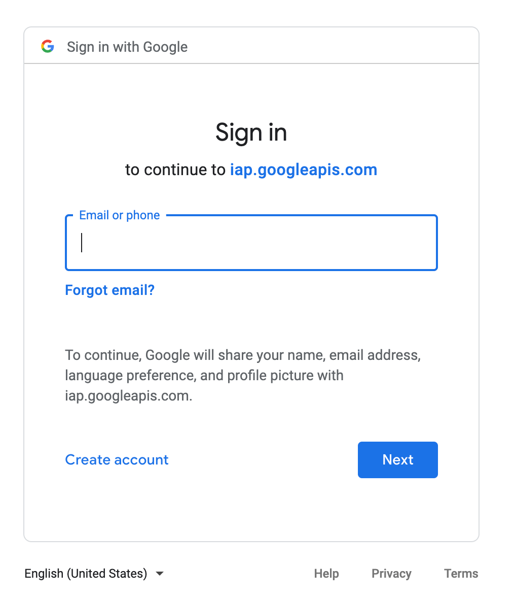

It's easy to create and maintain an [HTTPS-based static website on Cloud Storage](https://cloud.google.com/storage/docs/hosting-static-website) with Cloud CDN,
Cloud Load Balancing, managed SSL certificates, and custom domains. This serverless approach is popular because of its flexibility, scalability, and low cost.   
However, it can still be challenging to provide authentication and authorization for a static website on Google Cloud *in a serverless fashion*. This tutorial
describes a solution to protect static assets on Cloud Storage using Cloud Load Balancing
[serverless network endpoint groups (NEGs)](https://cloud.google.com/load-balancing/docs/negs/setting-up-serverless-negs).

The following diagram shows the high-level architecture of this solution:

The architecture incorporates the following key features:

1.  A load balancer to use a custom domain with a managed SSL certificate. When a request is received, the solution uses
    [routing rules](https://cloud.google.com/load-balancing/docs/https/setting-up-query-and-header-routing#http-header-based-routing) to check whether a
    [signed cookie for Cloud CDN](https://cloud.google.com/cdn/docs/private-content#signed_cookies) is in the request header. If the cookie doesn't exist, 
    the request is redirected to an app hosted on Cloud Run. If there is a signed cookie, the request is sent to the Cloud CDN of the backend bucket. __The Cloud Run app is necessary since IAP can be enabled for Cloud Run but not directly for GCS.__

1.  IAP performs the authentication when access the Cloud Run app. If the authentication is successful, the Cloud Run app
    [generates a signed cookie](https://cloud.google.com/cdn/docs/using-signed-cookies) and sends it back to the client with an HTTP redirect. The cookie works
    because the login app and the bucket backends are behind the same load balancer. Therefore, they are considered as the 
    [same origin](https://developer.mozilla.org/en-US/docs/Web/Security/Same-origin_policy).
    
    **Important:** Even if a user can access the default Cloud Run endpoint directly and log in from there, they still don't have access to the CDN because the 
    cookie is not from the same origin. Also, notice the cookie has a specific path instead of the default '/'.

1.  The CDN [signed cookie is verified by Cloud CDN](https://cloud.google.com/cdn/docs/using-signed-cookies), providing access to the static assets. You can
    specify an expiration time for the cookie. When the cookie has expired, modern browsers either delete the cookie or stop sending it. Cloud CDN also rejects
    expired cookies.

1.  Permit Cloud CDN to read the objects in the private bucket by adding the Cloud CDN service account to Cloud Storage access control lists (ACLs).

## Objectives 

-  Build a static website and deploy it to a Cloud Storage bucket.
-  Create a Cloud Load Balancing load balancer with a Google-managed SSL certificate.
-  Set up Cloud CDN with a backend bucket.
-  Deploy a service to Cloud Run and enable IAP.
-  Create serverless network endpoint groups for Cloud Load Balancing.
-  Create URL maps and route authenticated and unauthenticated traffic.

## Costs

This tutorial uses billable components of Google Cloud, including the following:

-  [Cloud Storage](https://cloud.google.com/storage/pricing)
-  [Cloud Load Balancing](https://cloud.google.com/vpc/network-pricing#lb)
-  [Cloud CDN](https://cloud.google.com/cdn/pricing)
-  [Cloud Run](https://cloud.google.com/run/pricing)
-  [Cloud Secret Manager](https://cloud.google.com/secret-manager#pricing)

Use the [pricing calculator](https://cloud.google.com/products/calculator) to generate a cost estimate based on your projected usage.

## Before you begin

For this tutorial, you need a Google Cloud [project](https://cloud.google.com/resource-manager/docs/cloud-platform-resource-hierarchy#projects). You can create a 
new project or select a project that you already created. When you finish this tutorial, you can avoid continued billing by deleting the resources you created. 
To make cleanup easiest, you may want to create a new project for this tutorial, so that you can delete the project when you're done. For details, see the 
"Cleaning up" section at the end of the tutorial.

To complete this tutorial, you need a domain that you own or manage. If you don't yet have a domain, there are many services through which you can register a
domain, such as [Google Domains](https://domains.google.com/). This tutorial uses the domain `democloud.info`.

1.  [Select or create a Google Cloud project.](https://console.cloud.google.com/projectselector2/home/dashboard)

1.  [Enable billing for your project.](https://support.google.com/cloud/answer/6293499#enable-billing)

1.  [Enable the Compute Engine, Cloud Run, Cloud Secret Manager, and Cloud DNS APIs.](https://console.cloud.google.com/flows/enableapi?apiid=compute.googleapis.com,run.googleapis.com,secretmanager.googleapis.com,dns.googleapis.com)  

1.  Make sure that you have either a project [owner or editor role](https://cloud.google.com/iam/docs/understanding-roles#primitive_roles), or sufficient 
    permissions to use the services listed in the previous section.

1.  [Verify that you own or manage the domain that you will be using](https://cloud.google.com/storage/docs/domain-name-verification#verification).

    Make sure that you are verifying the top-level domain, such as `example.com`, and not a subdomain, such as `www.example.com`.
    
    **Note:** If you own the domain that you are associating with a bucket, you might have already performed this step in the past. If you purchased your domain 
    through Google Domains, verification is automatic.

For information about using Cloud DNS to set up your domain, see
[Set up your domain using Cloud DNS](https://cloud.google.com/dns/docs/tutorials/create-domain-tutorial#set-up-domain).

## Using Cloud Shell

This tutorial uses the following tool packages:

* [`gcloud`](https://cloud.google.com/sdk/gcloud)
* [`gsutil`](https://cloud.google.com/storage/docs/gsutil)
* [`npm`](https://www.npmjs.com/get-npm)
* [`docker`](https://docs.docker.com/get-docker/)

Because [Cloud Shell](https://cloud.google.com/shell) automatically includes these packages, we recommend that you run the commands in this tutorial in Cloud
Shell, so that you don't need to install these packages locally.

## Preparing your environment

### Get the sample code

The sample code for this tutorial is in the
[Google Cloud Community GitHub repository](https://github.com/GoogleCloudPlatform/community/tree/master/tutorials/securing-gcs-static-website).

1.  Clone the repository:

        git clone https://github.com/xiangshen-dk/securing-gcs-static-assets-iap.git

1.  Go to the tutorial directory:

        cd securing-gcs-static-assets-iap/static-website

### Set environment variables

Set environment variables that you use throughout the tutorial:

    # Replace [YOUR_PROJECT_ID] with your project ID.
    export PROJECT_ID=[YOUR_PROJECT_ID]
    
    export PROJECT_NUM=$(gcloud projects describe ${PROJECT_ID} --format="value(projectNumber)")
    export REGION=us-central1
    export BUCKET_NAME=${PROJECT_ID}-example-com
    export SERVERLESS_NEG_NAME=login-web-serverless-neg
    export LOGIN_BACKEND_SVC_NAME=login-backend-service
    export STATIC_IP_NAME=private-static-web-external-ip
    export CDN_SIGN_KEY=private-static-web-cdn-key
    export GCS_PATH=static

### Set environment variables

    gcloud services enable \
        iap.googleapis.com \
        cloudresourcemanager.googleapis.com \
        cloudidentity.googleapis.com \
        compute.googleapis.com \
        cloudbuild.googleapis.com \
        run.googleapis.com \
        secretmanager.googleapis.com

## Implementation steps

### Build a static website and deploy it to Cloud Storage

1.  Build the demonstration single-page application (SPA):

        npm install
        npm run build

    This is a demonstration app using Vue.js. You can ignore any warnings from `npm`.

1.  Create a bucket:

        gsutil mb -b on gs://${BUCKET_NAME}
        
    For infomation on the `gsutil mb` command, see [the documentation](https://cloud.google.com/storage/docs/gsutil/commands/mb).   

1.  Upload the build artifacts, which are all static files:

        gsutil rsync -R dist/ gs://$BUCKET_NAME/${GCS_PATH}

    For infomation on the `gsutil rsync` command, see [the documentation](https://cloud.google.com/storage/docs/gsutil/commands/rsync).

1.  Set the `MainPageSuffix` property with the `-m` flag and the `NotFoundPage` with the `-e` flag:

        gsutil web set -m index.html -e index.html gs://$BUCKET_NAME
    
    For infomation on the `gsutil web set` command, see [the documentation](https://cloud.google.com/storage/docs/gsutil/commands/web#set).

### Create a load balancer 

1.  Reserve an external IP address, which will be used by the load balancer:

        gcloud compute addresses create $STATIC_IP_NAME \
            --network-tier=PREMIUM \
            --ip-version=IPV4 \
            --global

1.  Export the IP address:

        export SVC_IP_ADDR=$(gcloud compute addresses list --filter="name=${STATIC_IP_NAME}" \
        --format="value(address)" --global --project ${PROJECT_ID})

1.  Confirm that you have an IP address available in the `SVC_IP_ADDR` environment variable:

        echo ${SVC_IP_ADDR}

    Example output:

        34.120.180.189

1.  Create a domain using _nip.io_.

        export DNS_NAME=${SVC_IP_ADDR}.nip.io

    __Note:__ You can configure your DNS to use a custom domain name.

1.  Create an HTTPS load balancer, configure the bucket as a backend, and enable Cloud CDN for the load balancer:

        gcloud compute backend-buckets create web-backend-bucket \
            --gcs-bucket-name=$BUCKET_NAME \
            --enable-cdn

1.  Create a Google-managed SSL certificate.

        gcloud compute ssl-certificates create www-ssl-cert \
        --domains $DNS_NAME
    
1.  Check the status of your SSL certificate:

        gcloud compute ssl-certificates list | grep ${DNS_NAME}

    Example output:
    
        xxx.xxx.xxx.xxx.nio.io: PROVISIONING

    Initially, the status is `PROVISIONING`. The status will eventually (might take up to 60 minutes) change to `ACTIVE`. Until it is `ACTIVE`, you won't be able
    to access your service.

### Configure Cloud CDN

1.  Add a signing key to CDN:

        head -c 16 /dev/urandom | base64 | tr +/ -_ > key_file.txt

        gcloud compute backend-buckets \
        add-signed-url-key web-backend-bucket \
        --key-name $CDN_SIGN_KEY \
        --key-file key_file.txt

1.  Add the key to Secret Manager:

        gcloud secrets create $CDN_SIGN_KEY --data-file="./key_file.txt"

1.  To be safe, remove the data file:

        rm key_file.txt

1.  Configure IAM to allow the CDN service account to read the objects in the bucket:

        gsutil iam ch \
        serviceAccount:service-${PROJECT_NUM}@cloud-cdn-fill.iam.gserviceaccount.com:objectViewer gs://$BUCKET_NAME

    The Cloud CDN service account `[service-PROJECT_NUM@cloud-cdn-fill.iam.gserviceaccount.com]` doesn't appear in the list of service accounts in your project
    because the Cloud CDN service account is owned by Cloud CDN, not your project.

### Deploy the login service to Cloud Run

1. Build the Docker container for the login page and push it to Container Registry:

        cd ../flask_login

        docker build -t flask_login .
        docker tag flask_login gcr.io/$PROJECT_ID/flask_login
        docker push gcr.io/$PROJECT_ID/flask_login

1.  Deploy the Cloud Run service:

        gcloud run deploy $LOGIN_BACKEND_SVC_NAME \
        --image=gcr.io/$PROJECT_ID/flask_login --platform=managed \
        --region=$REGION --allow-unauthenticated \
        --set-env-vars=WEB_URL=https://$DNS_NAME,PROJECT_ID=$PROJECT_ID,CDN_SIGN_KEY=$CDN_SIGN_KEY,GCS_PATH="/${GCS_PATH}/"
    
     __Important:__ The path is needed here to make sure the CDN signed cookie will be the first in the cookie header string. It takes advantage of the fact that most browsers will sort the cookies from the longest path to the shortest path.

1.  Because the Cloud Run service needs to access the secrets saved in Secret Manager, grant the permission here:

        gcloud projects add-iam-policy-binding \
        --member=serviceAccount:${PROJECT_NUM}-compute@developer.gserviceaccount.com \
        --role=roles/secretmanager.secretAccessor $PROJECT_ID

    This demonstration provides the `secretAccessor` permission to the default compute service account. In a production environment, you probably want to use a 
    custom service account and only allow access to the needed secrets.

### Configure a serverless network endpoint group

1.  Create a network endpoint group (NEG) for the Cloud Run service:

        gcloud compute network-endpoint-groups create $SERVERLESS_NEG_NAME \
            --project $PROJECT_ID \
            --region=$REGION \
            --network-endpoint-type=SERVERLESS  \
            --cloud-run-service=$LOGIN_BACKEND_SVC_NAME

1.  Create a backend service and add the serverless NEG as a backend to the Cloud Run service.

        gcloud compute backend-services create $LOGIN_BACKEND_SVC_NAME \
            --global

        gcloud compute backend-services add-backend $LOGIN_BACKEND_SVC_NAME \
            --global \
            --network-endpoint-group=$SERVERLESS_NEG_NAME \
            --network-endpoint-group-region=$REGION

    A serverless NEG is needed here because that's how Cloud Run services can be associated with a load balancer.

### Create the URL map and configure forwarding rules

1.  Update the URL mapping file and create the URL map.

        sed -i -e "s/<DNS_NAME>/$DNS_NAME/" web-map-http.yaml
        sed -i -e "s/<PROJECT_ID>/$PROJECT_ID/" web-map-http.yaml
        sed -i -e "s/<LOGIN_BACKEND_SVC_NAME>/$LOGIN_BACKEND_SVC_NAME/" web-map-http.yaml

        gcloud compute url-maps import web-map-http --source web-map-http.yaml --global

    This step updates the values in the template URL map file and imports it. A final configuration looks like the following:

        defaultService: https://www.googleapis.com/compute/v1/projects/democlound-test/global/backendBuckets/private-web
        kind: compute#urlMap
        name: web-map-http
        hostRules:
        - hosts:
        - 'web.democloud.info'
        pathMatcher: matcher1
        pathMatchers:
        - defaultService: https://www.googleapis.com/compute/v1/projects/democlound-test/global/backendBuckets/private-web
        name: matcher1
        routeRules:
            - matchRules:
                - prefixMatch: /
                headerMatches:
                    - headerName: cookie
                    prefixMatch: 'Cloud-CDN-Cookie'
            priority: 0
            service: https://www.googleapis.com/compute/v1/projects/democlound-test/global/backendBuckets/private-web
            - matchRules:
                - prefixMatch: /
            priority: 1
            service: https://www.googleapis.com/compute/v1/projects/democlound-test/global/backendServices/flasklogin-backend-service

    In this configuration, a route rule is configured to match a cookie starting with `Cloud-CDN-Cookie` in the request header. If it's matched, the request is 
    forwarded to the backend bucket service. Otherwise, it is forwarded to the login backend service. The cookie `Cloud-CDN-Cookie` is the signed cookie
    mentioned earlier. It is set by the Cloud Run service after successful IAP authentication.

    __Note:__ As of 5/2022, `regexMatch` is not supported for `headerMatches` in external HTTPS load balancer. Therefore, `prefixMatch` is used here. For `prefixMatch`, the Cloud-CDN-Cookie needs to be the first one in the cookie header. That's why a path is introduced to let the browsers sort the cookies and make the Cloud-CDN-Cookie the first one. 

1.  Create a target HTTPS proxy with the URL map:

        gcloud compute target-https-proxies create https-lb-proxy --url-map web-map-http --ssl-certificates=www-ssl-cert

1.  Create the forwarding rule with the reserved IP address:

        gcloud compute forwarding-rules create private-web-https-rule --address=$STATIC_IP_NAME --global --target-https-proxy=https-lb-proxy --ports=443

## Enabling IAP on the Load Balancer

### Configuring the OAuth consent screen
A brand is the OAuth consent screen that contains branding information for users. Brands might be restricted to internal or public users. An internal brand allows the OAuth flow to be accessed by a member of the same Google Workspace organization as the project. A public brand makes the OAuth flow accessible to anyone with access to the internet.

1.  Create a brand

        export USER_EMAIL=$(gcloud config list account --format "value(core.account)")

        gcloud alpha iap oauth-brands create \
            --application_title="Static web site" \
            --support_email=$USER_EMAIL

    Example Output

        Created [462858740426].
        applicationTitle: Static web site
        name: projects/462858740426/brands/462858740426
        orgInternalOnly: true

1.  Creating an IAP OAuth Client

    Create a client using the brand name from the previous step

        gcloud alpha iap oauth-clients create \
            projects/$PROJECT_ID/brands/$PROJECT_NUM \
            --display_name=static-web-site

    Example Output

        Created [xxxxxxxxxfllsd.apps.googleusercontent.com].
        displayName: static-web-site
        name: projects/462858740426/brands/462858740426/identityAwareProxyClients/462858740426-xxxxxfllsd.apps.googleusercontent.com
        secret: [secret-removed]

1.  Store the client name, ID and secret

        export CLIENT_NAME=$(gcloud alpha iap oauth-clients list \
            projects/$PROJECT_NUM/brands/$PROJECT_NUM --format='value(name)' \
            --filter="displayName:static-web-site")

        export CLIENT_ID=${CLIENT_NAME##*/}

        export CLIENT_SECRET=$(gcloud alpha iap oauth-clients describe $CLIENT_NAME --format='value(secret)')

1.  In the Cloud Console, select the project from the drop-down project selection menu

1.  Navigate to the [OAuth consent screen](https://console.cloud.google.com/apis/credentials/consent) in the Cloud Console 

1.  Click __MAKE EXTERNAL__ under User Type
1.  Select __Testing__ as the Publishing status
1.  Click __CONFIRM__

1.  Enable IAP on the backend service

        gcloud iap web enable --resource-type=backend-services \
            --oauth2-client-id=$CLIENT_ID \
            --oauth2-client-secret=$CLIENT_SECRET \
            --service=$LOGIN_BACKEND_SVC_NAME

1.  Add an IAM policy binding for the role of `roles/iap.httpsResourceAccessor` for the user created in the previous step

        gcloud iap web add-iam-policy-binding \
            --resource-type=backend-services \
            --service=$LOGIN_BACKEND_SVC_NAME \
            --member=user:$USER_EMAIL \
            --role='roles/iap.httpsResourceAccessor'

    __Note:__ you can add addtional Google user or group for access.

## Test the website

1.  To make sure that the managed SSL certificate has been successfully provisioned, run the following command: 

        gcloud compute ssl-certificates list | grep ${DNS_NAME}
    
    The status should be `ACTIVE`:

1.  Get the URL:

        echo https://$DNS_NAME/$GCS_PATH/index.html

    __Note:__ Both the SSL certificate and the DNS name propagation need some time. Wait a few minutes if the page is not accessible.

1.  Try to open a file hosted in the bucket.

    The first time, you'll be redirected to the login page. For example:

    

1.  Enter the user email you got from a previous step and its password. You should have the page like the following:

    
    
1.  Try again to open a file hostead in the bucket:

    

## Cleaning up

To avoid incurring charges to your Google Cloud account for the resources used in this tutorial, you can delete the resources that you created. You can either 
delete the entire project or delete individual resources.

Deleting a project has the following effects:

* Everything in the project is deleted. If you used an existing project for this tutorial, when you delete it, you also delete any other work you've done in the
  project.
* Custom project IDs are lost. When you created this project, you might have created a custom project ID that you want to use in the future. To preserve the URLs
  that use the project ID, delete selected resources inside the project instead of deleting the whole project.

If you plan to explore multiple tutorials, reusing projects can help you to avoid exceeding project quota limits.

### Delete the project

The easiest way to eliminate billing is to delete the project you created for the tutorial. 

1.  In the Cloud Console, go to the [**Manage resources** page](https://console.cloud.google.com/iam-admin/projects).  
1.  In the project list, select the project that you want to delete and then click **Delete**.
1.  In the dialog, type the project ID and then click **Shut down** to delete the project.

### Delete the resources

If you don't want to delete the project, you can delete the provisioned resources:

    gcloud compute forwarding-rules delete private-web-https-rule --global

    gcloud compute target-https-proxies delete https-lb-proxy

    gcloud compute url-maps delete web-map-http

    gcloud compute backend-services delete $LOGIN_BACKEND_SVC_NAME --global

    gcloud compute network-endpoint-groups delete $SERVERLESS_NEG_NAME --region $REGION

    gcloud projects remove-iam-policy-binding $PROJECT_ID \
        --member=serviceAccount:${PROJECT_NUM}-compute@developer.gserviceaccount.com \
        --role=roles/secretmanager.secretAccessor

    gcloud run services delete $LOGIN_BACKEND_SVC_NAME \
        --platform=managed --region=$REGION 

    gcloud container images delete gcr.io/$PROJECT_ID/flask_login

    gcloud secrets delete $CDN_SIGN_KEY

    gcloud compute ssl-certificates delete www-ssl-cert

    gcloud compute backend-buckets delete web-backend-bucket

    gcloud compute addresses delete $STATIC_IP_NAME --global

    gsutil rm -r gs://$BUCKET_NAME

Finally, remove the DNS record in your DNS registry.

## What's next

-  Learn more about [securing Cloud Run services](https://cloud.google.com/run/docs/tutorials/secure-services).
-  Learn more about to improve reliability of Cloud Run services by [serving traffic from multiple regions](https://cloud.google.com/run/docs/multiple-regions).
-  Try out other Google Cloud features for yourself. Have a look at those [tutorials](https://cloud.google.com/docs/tutorials).
